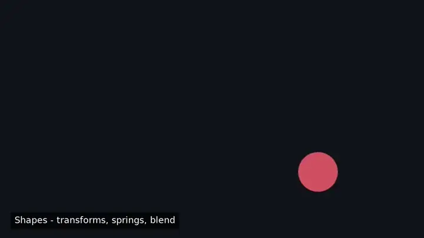

# glissade

*(glide & slide)* — programmatic motion graphics for TypeScript. Realtime-first in any web page; deterministic, headless video export from the same code; a visual studio over the same document. **No generator functions.**

```ts
const mod: SceneModule = {
  createScene: () =>
    createScene({
      size: { w: 640, h: 360 },
      children: [new Circle({ id: 'dot', radius: 40, fill: '#e6a700', position: [120, 180], opacity: 0 })],
    }),
  timeline: timeline((tl) => {
    tl.to('dot/opacity', 1, { duration: 0.5 })
      .to('dot/position.x', 520, { ease: spring({ stiffness: 170, damping: 14 }) })
      .label('arrived')
      .to('dot/fill', '#7c4dff', { duration: 0.6, at: 'arrived' });
  }),
};
```

```sh
gs render my-scene.ts --out out.mp4   # headless Skia + FFmpeg — no browser, faster than realtime
```

One contract underneath everything: `evaluate(scene, timeline, t)` is a **pure function of time**. The builder above compiles to a serializable keyframe document — nothing executes at play time — so the same scene scrubs at 60fps in a `<canvas>`, renders byte-identical PNGs in CI, exports via WebCodecs in the browser, and opens in the studio.

<p align="center">
  
</p>

<p align="center"><sub>A tour of the framework — shapes &amp; springs, bezier &amp; motion paths, typography &amp; captions, hand-drawn sketch, flex layout, filters, the cross-frame subtree cache, SVG import, UI micro-interactions, and animatable gradient <code>Paint</code>. Every clip rendered headless with <code>gs render</code>, byte-identical every run · <a href="packages/examples/src/scenes">scene sources</a></sub></p>

## Why it exists

| | glissade | Motion Canvas | Remotion |
|---|---|---|---|
| License | **Apache-2.0** | MIT (dormant) | source-available, paid >3 employees |
| Authoring | signals + keyframes; fluent builder | generator coroutines | React, pure function of frame |
| Backward scrub | O(log keys) lookup | replay from scene start | re-render |
| Headless render | first-class CLI (`gs render`) | editor button only | headless Chromium screenshots |
| In-browser export | WebCodecs, faster than realtime | — | — |
| Audio export | FFmpeg / OfflineAudioContext mix | never shipped | ✓ |
| Stateful sim under seeking | first-class `bake()` | n/a (imperative) | manual workarounds |

## What works today

- **`@glissade/core`** — pull-based signals (lazy, cached, dependency-tracked, equal-value-pruned), keyframe tracks with pluggable value types (OKLab color, vec2, …), the Timeline document with nesting, closed-form springs, the fluent builder, `bake()`/`bakeCheckpointed()` for physics, seeded RNG, sidecar merging. Zero DOM/Node deps.
- **`@glissade/scene`** — Group/Rect/Circle/Text/Image/Video nodes with signal props, computed transform matrices, and a flat serializable DisplayList IR; `evaluate()`.
- **`@glissade/backend-canvas2d` / `@glissade/backend-skia`** — the same command stream rasterized in the browser and headless (both Skia-family; SSIM-gated parity suite).
- **`@glissade/player`** — time-based Player (reverse = negative rate, drop-safe), Driver seam (rAF clock, scroll), `mount()`.
- **`@glissade/cli`** — `gs render` to PNG sequences or mp4/webm with mixed audio; FFmpeg-extracted video assets.
- **`@glissade/export-web`** — WebCodecs + Mediabunny export with feature-detected codecs; Mediabunny video decode with bidirectional scrub.
- **`@glissade/studio` + `@glissade/vite-plugin` + `@glissade/react`** — viewport, transport, timeline panel with draggable keys, live inspector; GUI edits persist to `*.edits.json` sidecars and survive code edits (code owns structure, the editor owns the keys you touch).

Determinism is CI-enforced: golden frames byte-compare across machines on the pinned toolchain — an agent can write a scene and a headless test can assert frame 120.

## Showcase

A gallery of widget patterns — six spinners, loaders with shimmer skeletons, a self-assembling mock dashboard, screen transitions (slide/wipe/fade), and micro-interactions (toggle, checkbox, ripple, toast) — all plain nodes + timelines:

```sh
pnpm --filter @glissade/examples dev   # the showcase is the landing page; minimal demo at /demo.html
```

## Docs

[Getting started](docs/getting-started.md) · [Core concepts](docs/concepts.md) · [Migrating from Motion Canvas](docs/migrating-from-motion-canvas.md) · [Architecture & design](docs/DESIGN.md) · [Contributing](CONTRIBUTING.md)

## Status

Pre-release (`0.x`, unpublished): APIs may move, the Timeline document schema is versioned and stable-intentioned. Packages version in lockstep; in `0.x` a minor bump may break — see [BREAKING.md](BREAKING.md) for the policy and change log. Inspired by [Motion Canvas](https://github.com/motion-canvas/motion-canvas) (MIT) and, at the concept level only, Remotion — this is a clean-room design; no Remotion code is referenced or used (see CONTRIBUTING).

## License

[Apache-2.0](LICENSE)
